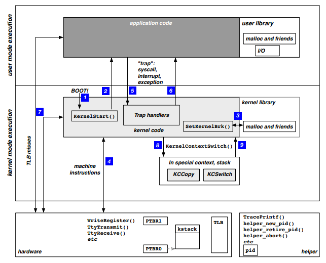
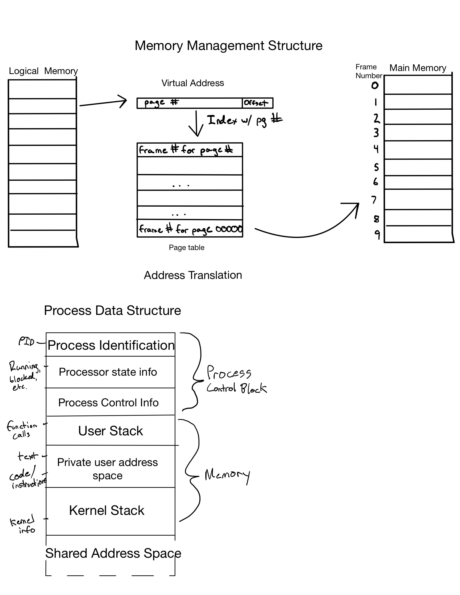
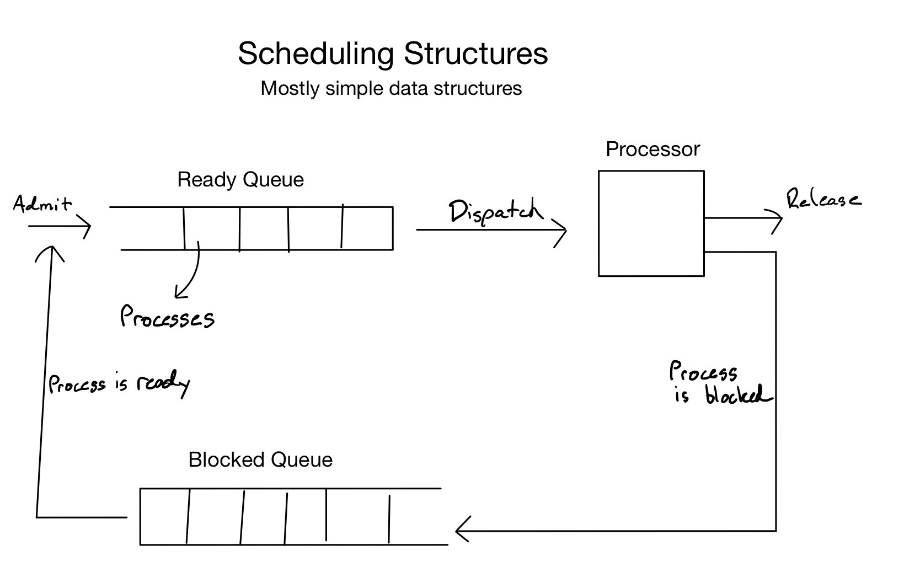

# PA3

Team Members: William R Roberts, Janet Madrid, Logan Ladd, Nick H.

[Link to Demo Video](https://montana.techsmithrelay.com/Gz6W?tab=Details)

## Summary

This Programming assignment we are tasked with designing and writing pseudocode of the Operating System. To be clear, this is not source code, and won't run (there aren't even any source files), and reflects only a high-level view of an Operating System (specifically Yalnix).

For the most part, the [Yalnix Project Manual](https://www.traviswpeters.com/cs460-2020-fall/yalnix/yalnix2020.pdf) was the inspiration for pseudocode within this programming assignment. It offers a lot of information on the implementation of functions, data structures, and the other moving parts of this complex piece of software.

## Assignment

Below are the different parts of this assignment. You can navigate the different sections by clicking on the links to files within this project.

### Sketches of the OS and its Data Structures

The Operating System is filled with important data structures. These pieces of code hold the important information that the OS itself uses to perform it's duties. There are many important data strucutres, but some of the most important (and the ones that we delved the most into through this course) are sketched out here. These sketches are simple, and reflect the general designing process that would occur before actually sitting down and creating the complex system that is the OS.

#### The Layout

Here we can see the general flow of our OS. Each chunk of this complex program requires information from several different data structures, processes, and control blocks.

#### Processes and Memory

This next sketch is a simple overview of the data structures that make up our Process, as well as the way that those processes have their virtual memory mapped to physical memory. Many of these data structures are simple in nature, but during the design phase it is important that all team members understand the exact layout, so sketches like this are important.

As we can see, Processes are really just data structures, and the Process Control Block (which is arguably the most important data structure of the Modern OS), is simply realized in this sketch. This PCB is referenced in almost everything the OS does with processes, and enables multiprogramming. We will see the simple data structures that handle the different processes in the next sketch.

The idea of Memory Management allows the Operating System to give each Process the "illusion" that it owns all of the memory space, while also isolating the machine's memory based on which process owns it. Logical memory maps to physical memory via Address Translation, in which Virtual Addresses (within User Space) are translated from Page numbers to Frame numbers in physical memory. The Process Data Structure holds the information that is paramount both to managing it's own memory, as well as to the Operating System's task of Scheduling processes.

#### Scheduling

Scheduling is the Operating System's perview, and without it we wouldn't have multiprogramming, or computer multitasking at all! As we can see, each Process is handled by 2 separate queues, the Ready and the Blocked queue. A process gets moved onto the processor when one gets moved off, in which it goes from the state "ready" to "running". A process that gets blocked (interrupts usually, some Trap) goes to the "blocked" state and is moved off the processor into the Blocked Queue. Here, it waits until it is no longer blocked and then gets back into "the end of the line" in the Ready Queue.

 In this sketch we can see that the general idea for scheduling processes is very simple, and indeed in our OS (as of now) a process is only switched on or off the processor if another one gets blocked (as opposed to there being an additional Time Out if a process doesn't block, which will be added later).

### The Major Functions

The most important parts of the Operating System are those that control all the moving parts. The file [majorFunctions.md](src/majorFunctions.md) offers simplistic pseudocode for operations like the boot process, scheduling, and context switching.

### Syscalls

Syscalls are the basis that allows a program/process to talk with the kernel. Without these, processes either wouldn't be able to interface with the machine AT ALL, or would have to allowed to run in kernel mode all the time (which is very dangerous and difficult!). Pseudocode for the Syscalls can be found within [Syscalls](src/syscallsPC.md).

### Traps and Trap Handler

Traps are what enable the OS to operate many processes at the same time, so it can be argued that they are one of the most important aspects of the Operating System. Pseudocode for the traps found within Yanlix, as well as the Handler that controls the process of traps can be found within [Traps](src/TrapPseudocode.md).
